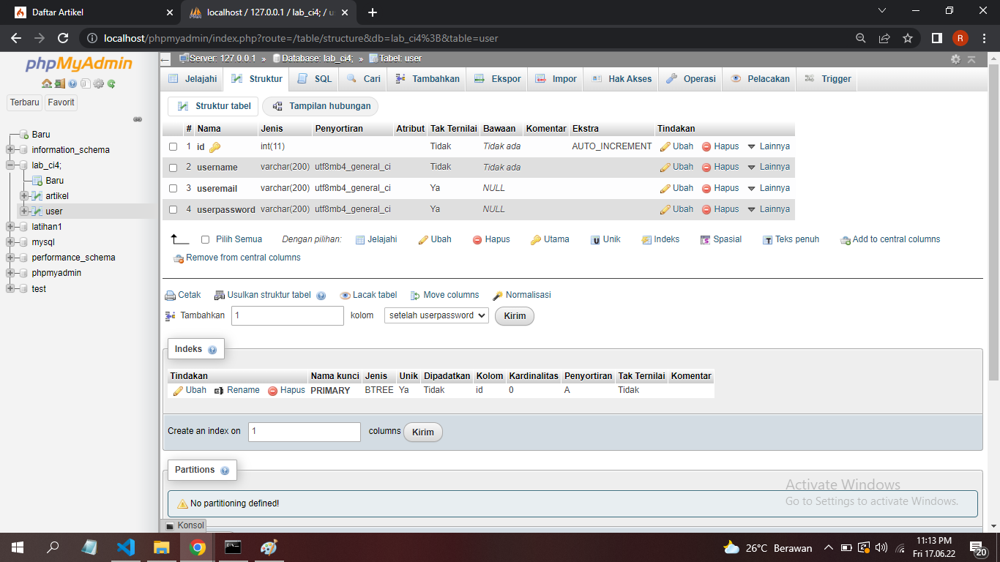
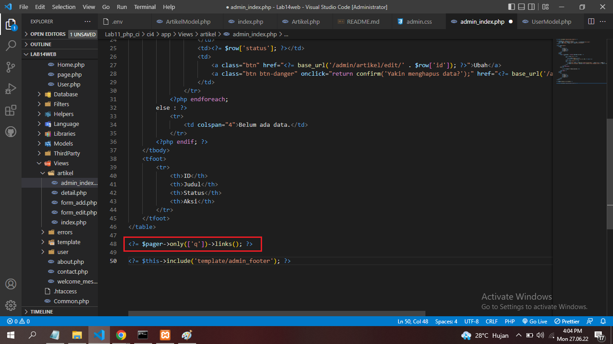

# Praktikum 11

## Profil
| | Biodata |
| -------- | --- |
| **Nama** | Rangga Saputra |
| **NIM** | 312010266 |
| **Kelas** | TI.20.A2 |
| **Mata Kuliah** | Pemrograman Web |


## Persiapan
Sebelum memulai menggunakan Framework Codeigniter, perlu dilakukan konfigurasi pada webserver. Beberapa ekstensi PHP perlu diaktifkan untuk kebutuhan pengembangan Codeigniter 4.

Berikut beberapa ekstensi yang perlu diaktifkan:

• php-json ekstension untuk bekerja dengan JSON;

• php-mysqlnd native driver untuk MySQL;

• php-xml ekstension untuk bekerja dengan XML;

• php-intl ekstensi untuk membuat aplikasi multibahasa;

• libcurl (opsional), jika ingin pakai Curl.

## 1. Mengaktifkan Ekstentsi

Untuk mengaktifkan ekstentsi tersebut, melalui **XAMPP Control Panel**, pada bagian Apache klik **Config -> PHP.ini**


Pada bagian extention, hilangkan tanda ; (titik koma) pada ekstensi yang akan diaktifkan. Kemudian simpan kembali filenya dan restart Apache web server.


### 2. Kemudian buat folder baru bernama `Lab11_php_ci`


## 3. Instalasi Codeigniter 4
Untuk melakukan instalasi Codeigniter 4 dapat dilakukan dengan dua cara, yaitu cara manual dan menggunakan ***composer***. Pada praktikum ini kita menggunakan cara manual.

• Unduh **Codeigniter** dari website https://codeigniter.com/download

• Extrak file zip Codeigniter ke direktori **htdocs/lab11_ci**.

• Ubah nama direktory **framework-4.x.xx** menjadi **ci4**.

• Buka browser dengan alamat http://localhost/Lab11web/lab11_php_ci/ci4/public


## 3. Menjalankan CLI (Command Line Interface)
Codeigniter 4 menyediakan CLI untuk mempermudah proses development. Untuk mengakses CLI buka terminal/command prompt.


Arahkan lokasi direktori sesuai dengan direktori kerja project dibuat **(xampp/htdocs/lab11web/lab11_php_ci/ci4/)**

Perintah yang dapat dijalankan untuk memanggil CLI Codeigniter adalah:

```
php spark
```


## 4. Mengaktifkan Mode Debugging
Codeigniter 4 menyediakan fitur **debugging** untuk memudahkan developer untuk mengetahui pesan error apabila terjadi kesalahan dalam membuat kode program.

Secara default fitur ini belum aktif. Ketika terjadi error pada aplikasi akan ditampilkan pesan kesalahan seperti berikut.


Semua jenis error akan ditampilkan sama. Untuk memudahkan mengetahui jenis errornya, maka perlu diaktifkan mode debugging dengan mengubah nilai konfigurasi pada environment variable **CI_ENVIRINMENT** menjadi **development**.


Ubah nama file **env** menjadi **.env** kemudian buka file tersebut dan ubah nilai variable **CI_ENVIRINMENT** menjadi **development**.


Contoh error yang terjadi. Untuk mencoba error tersebut, ubah kode pada file **app/Controller/Home.php** hilangkan titik koma pada akhir kode.


## 5. Membuat Route Baru

Tambahkan kode berikut di dalam **Routes.php**

```php
$routes->get('/about', 'Page::about');
$routes->get('/contact', 'Page::contact');
$routes->get('/faqs', 'Page::faqs');
```

Untuk mengetahui route yang ditambahkan sudah benar, buka CLI dan jalankan perintah berikut.

```
php spark routes
```


Selanjutnya coba akses route yang telah dibuat dengan mengakses alamat url 
http://localhost:8080/about


Ketika diakses akan mucul tampilan error 404 file not found, itu artinya file/page tersebut tidak ada. Untuk dapat mengakses halaman tersebut, harus dibuat terlebih dahulu Contoller yang sesuai dengan routing yang dibuat yaitu Contoller Page.

## 6. Membuat Controller

Selanjutnya adalah membuat Controller Page. Buat file baru dengan nama page.php pada direktori Controller kemudian isi kodenya seperti berikut.

```php
<?php
namespace App\Controllers;
class Page extends BaseController
{
    public function about()
    {
        echo "Ini halaman About";
    }
    public function contact()
    {
        echo "Ini halaman Contact";
    }
    public function faqs()
    {
        echo "Ini halaman FAQ";
    }
}
```

Selanjutnya refresh Kembali browser, maka akan ditampilkan hasilnya yaotu halaman sudah dapat diakses.


## 7. Auto Routing

Secara default fitur *autoroute* pada Codeiginiter sudah aktif. Untuk mengubah status autoroute dapat mengubah nilai variabelnya. Untuk menonaktifkan ubah nilai **true** menjadi **false**.

```php
$routes->setAutoRoute(true);
```

Tambahkan method baru pada **Controller Page** seperti berikut.

```php
public function tos()
{
    echo "ini halaman Term of Services";
}
```

Method ini belum ada pada **routing**, sehingga cara mengaksesnya dengan menggunakan alamat: http://localhost:8080/page/tos


## 8. Membuat View
Selanjutnya adalam membuat view untuk tampilan web agar lebih menarik. Buat file baru dengan nama about.php pada direktori view (**app/view/about.php**) kemudian isi kodenya seperti berikut.

```php
<!DOCTYPE html>
<html lang="en">
<head>
    <meta charset="UTF-8">
    <title><?= $title; ?></title>
</head>
<body>
    <h1><?= $title; ?></h1>
    <hr>
    <p><?= $content; ?></p>
</body>
</html>
```

Ubah **method about** pada class **Controller Page** menjadi seperti berikut:

```php
public function about()
{
    return view('about', [
        'title' => 'Halaman About',
        'content' => 'Ini adalah halaman abaut yang menjelaskan tentang isi halaman ini.'
    ]);
}
```

Kemudian lakukan refresh pada halaman tersebut.


## 9. Membuat Layout Web dengan CSS
Pada dasarnya layout web dengan css dapat diimplamentasikan dengan mudah pada codeigniter. Yang perlu diketahui adalah, pada Codeigniter 4 file yang menyimpan asset css dan javascript terletak pada direktori **public**. 

Buat file css pada direktori **public** dengan nama **style.css** (copy file dari praktikum **lab4_layout**. Kita akan gunakan layout yang pernah dibuat pada praktikum 4.


Kemudian buat folder **template** pada direktori **view** kemudian buat file **header.php** dan **footer.php**

File **app/view/template/header.php**

```html
<!DOCTYPE html>
<html lang="en">
<head>
    <meta charset="UTF-8">
    <title><?= $title; ?></title>
    <link rel="stylesheet" href="<?= base_url('/style.css');?>">
</head>
<body>
    <div id="container">
    <header>
        <h1>Layout Sederhana</h1>
    </header>
    <nav>
        <a href="<?= base_url('/');?>" class="active">Home</a>
        <a href="<?= base_url('/artikel');?>">Artikel</a>
        <a href="<?= base_url('/about');?>">About</a>
        <a href="<?= base_url('/contact');?>">Kontak</a>
    </nav>
    <section id="wrapper">
        <section id="main">
```

File **app/view/template/footer.php**

```html
        </section>
        <aside id="sidebar">
            <div class="widget-box">
                <h3 class="title">Widget Header</h3>
                <ul>
                    <li><a href="#">Widget Link</a></li>
                    <li><a href="#">Widget Link</a></li>
                </ul>
            </div>
            <div class="widget-box">
                <h3 class="title">Widget Text</h3>
                <p>Vestibulum lorem elit, iaculis in nisl volutpat, malesuada tincidunt arcu. Proin in leo fringilla, vestibulum mi porta, faucibus felis. Integer pharetra est nunc, nec pretium nunc pretium ac.</p>
            </div>
        </aside>
    </section>
    <footer>
        <p>&copy; 2022 | Rangga Saputra</p>
    </footer>
    </div>
</body>
</html>    
```

Kemudian ubah file **app/view/about.php** seperti berikut.

```php
<?= $this->include('template/header'); ?>
<h1><?= $title; ?></h1>
<hr>
<p><?= $content; ?></p>
<?= $this->include('template/footer'); ?>
```

Selanjutnya refresh tampilan pada alamat http://localhost:8080/about


# Pertanyaan dan Tugas
Lengkapi kode program untuk menu lainnya yang ada pada Controller Page, sehingga semua link pada navigasi header dapat menampilkan tampilan dengan layout yang sama.

# Hasil


Untuk halaman **About**


Untuk halaman **Kontak**


## Tugas Lab 11 Web (Praktikum 12 CRUD)
1. Buat database baru dengan nama lab_ci4 dengan query berikut
CREATE DATABASE `lab_ci4`
2. Membuat Table baru dengan nama artikel dengan query berikut.
```
CREATE TABLE artikel {
    id INT(11) auto_increment,
    judul VARCHAR(200) NOT NULL,
    isi TEXT,
    gambar VARCHAR(200),
    status TINYINT(1) DEFAULT 0,
    slug VARCHAR(200),
    PRIMARY KEY(id)
}
```
## Langkah 2 - Konfigurasi Koneksi Database
Konfigurasi dapat dilakukan dengan cara mengubah beberapa kode pada file htdocs\lab11_php_ci\ci4\.env.
1. Cari pada line DATABASE
2. Ubah seperti berikut ini
```
# database.default.hostname = localhost
# database.default.database = lab_ci4
# database.default.username = root
# database.default.password = 
# database.default.DBDriver = MySQLi
# database.default.DBPrefix =
```
Hilangkan tanda pagar # didepan. Maka jadi seperti dibawah ini.
```
database.default.hostname = localhost
database.default.database = lab_ci4
database.default.username = root
database.default.password = 
database.default.DBDriver = MySQLi
database.default.DBPrefix =
```

## Langkah 3 - Membuat Model
Selanjutnya adalah membuat Model untuk memproses data Artikel. Buat file baru pada direktori `app/Models` dengan nama `ArtikelModel.php`
```php
<?php

namespace App\Models;

use CodeIgniter\Model;

class ArtikelModel extends Model
{
    protected $table = 'artikel';
    protected $primaryKey = 'id';
    protected $useAutoIncrement = true;
    protected $allowedFields = ['judul', 'isi', 'status', 'slug', 'gambar'];
}
```
Langkah 4 - Membuat Controller
Buat Controller baru dengan nama `Artikel.php` pada direktori `app/Controllers`.
```php
<?php

namespace App\Controllers;

use App\Models\ArtikelModel;

class Artikel extends BaseController
{
    public function index()
    {
        $title = 'Daftar Artikel';
        $model = new ArtikelModel();
        $artikel = $model->findAll();
        return view('artikel/index', compact('artikel', 'title'));
    }
}
```
## Langkah 4 - Membuat View
Buat folder baru dengan nama `artikel` pada direktori `app/views`, kemudian buat file baru dengan nama `index.php`.
```php
<?= $this->include('template/header'); ?>

<?php if($artikel): foreach($artikel as $row): ?>
<article class="entry">
    <h2><a href="<?= base_url('/artikel/' . $row['slug']);?>"><?=$row['judul']; ?></a></h2>
    " alt="<?=$row['judul']; ?>">
    <p><?= substr($row['isi'], 0, 200); ?></p>
</article>
<hr class="divider" />
<?php endforeach; else: ?>
<article class="entry">
    <h2>Belum ada data.</h2>
</article>
<?php endif; ?>

<?= $this->include('template/footer'); ?>
```
selanjutnya buka browser kembali, dengan mengakses url http://localhost:8080/artikel


Karena datanya belum ada, kita tambah data dengan menjalan query berikut diphpmyadmin.
```
INSERT INTO artikel (judul, isi, slug) VALUE
('Artikel pertama', 'Lorem Ipsum adalah contoh teks atau dummy dalam industri
percetakan dan penataan huruf atau typesetting. Lorem Ipsum telah menjadi
standar contoh teks sejak tahun 1500an, saat seorang tukang cetak yang tidak
dikenal mengambil sebuah kumpulan teks dan mengacaknya untuk menjadi sebuah
buku contoh huruf.', 'artikel-pertama'),
('Artikel kedua', 'Tidak seperti anggapan banyak orang, Lorem Ipsum bukanlah
teks-teks yang diacak. Ia berakar dari sebuah naskah sastra latin klasik dari
era 45 sebelum masehi, hingga bisa dipastikan usianya telah mencapai lebih
dari 2000 tahun.', 'artikel-kedua');
```
* Refresh kembali browser, sehingga akan ditampilkan hasilnya.


## Langkah 5 - Membuat Tampilan Detail Artikel
ampilan pada saat judul berita di klik maka akan diarahkan ke halaman yang berbeda. Tambahkan fungsi baru pada `Controller Artikel` dengan nama `view()`.
```php
public function view($slug)
    {
        $model = new ArtikelModel();
        $artikel = $model->where(['slug' => $slug])->first();
        // Menampilkan error apabila data tidak ada.
        if (!$artikel)
        {
            throw PageNotFoundException::forPageNotFound();
        }
        $title = $artikel['judul'];
        return view('artikel/detail', compact('artikel', 'title'));
    }
```
## Langkah 6 - Membuat View Detail
Buat view baru untuk halaman detail dengan nama `app/views/artikel/detail.php`.
```html b 
<?= $this->include('template/header'); ?>

<article class="entry">
    <h2><?= $artikel['judul']; ?></h2>
    " alt="<?=$artikel['judul']; ?>">
    <p><?= $artikel['isi']; ?></p>
</article>

<?= $this->include('template/footer'); ?>
```
## Langkah 7 - Membuat Routing untuk artikel detail
Buka Kembali file `app/config/Routes.php`, kemudian tambahkan routing untuk artikel detail.
```
$routes->get('/artikel/(:any)', 'Artikel::view/$1');
```


## Langkah 8 - Membuat Menu Admin
Buat method baru pada `Controller Artikel` dengan nama `admin_index()`.
```php
public function admin_index()
    {
        $title = 'Daftar Artikel';
        $model = new ArtikelModel();
        $artikel = $model->findAll();
        return view('artikel/admin_index', compact('artikel', 'title'));
    }
```

Kemudian buat view untuk tampilan admin dengan nama `admin_index.php`.
```html
<?= $this->include('template/admin_header'); ?>

<table class="table">
    <thead>
        <tr>
            <th>ID</th>
            <th>Judul</th>
            <th>Status</th>
            <th>Aksi</th>
        </tr>
    </thead>
    <tbody>
    <?php if($artikel): foreach($artikel as $row): ?>
    <tr>
        <td><?= $row['id']; ?></td>
        <td>
            <b><?= $row['judul']; ?></b>
            <p><small><?= substr($row['isi'], 0, 50); ?></small></p>
        </td>
        <td><?= $row['status']; ?></td>
        <td>
            <a class="btn" href="<?= base_url('/admin/artikel/edit/' .$row['id']);?>">Ubah</a>
            <a class="btn btn-danger" onclick="return confirm('Yakin menghapus data?');" href="<?= base_url('/admin/artikel/delete/' .$row['id']);?>">Hapus</a>
        </td>
    </tr>
    <?php endforeach; else: ?>
    <tr>
        <td colspan="4">Belum ada data.</td>
    </tr>
    <?php endif; ?>
    </tbody>
    <tfoot>
        <tr>
            <th>ID</th>
            <th>Judul</th>
            <th>Status</th>
            <th>Aksi</th>
        </tr>
    </tfoot>
</table>

<?= $this->include('template/admin_footer'); ?>
```
Tambahkan routing untuk menu admin seperti berikut:
```php
$routes->group('admin', function($routes) {
  $routes->get('artikel', 'Artikel::admin_index');
  $routes->add('artikel/add', 'Artikel::add');
  $routes->add('artikel/edit/(:any)', 'Artikel::edit/$1');
  $routes->get('artikel/delete/(:any)', 'Artikel::delete/$1');
});
```
Setelah itu buat template header dan footer baru untuk Halaman Admin. Buat file baru dengan nama `admin_header.php` pada direktori `app/view/template`

```html
<!DOCTYPE html>
<html lang="en">
<head>
    <meta charset="UTF-8">
    <title><?= $title; ?></title>
    <link rel="stylesheet" href="<?= base_url('/admin.css');?>">
</head>
<body>
    <div id="container">
    <header>
        <h1>Halaman Admin</h1>
    </header>
    <nav>
    <a href="<?= base_url('/admin/artikel');?>" class="active">Dashboard</a>
        <a href="<?= base_url('/artikel');?>">Artikel</a>
        <a href="<?= base_url('/admin/artikel/add');?>">Tambah Artikel</a>
    </nav>
    <section id="wrapper">
        <section id="main">
```
Dan Buat file baru lagi dengan nama `admin_footer.php` pada direktori `app/view/template`
```html
<footer class="bg-dark text-white p-3 text-center">
    <p class="m-0">&copy; 2022 - Universitas Pelita Bangsa @ Rangga Saputra</p>
</footer>


<script src="<?= base_url('js/bootstrap.min.js') ?>"></script>
</body>

</html>
```
Kemudian buat file baru lagi dengan nama `admin.css` pada direktori `ci4/public` untuk mempercantik tampilan Halaman Admin
```css
/* Reset CSS */
* {
    margin: 0;
    padding: 0;
}
body {
    line-height:1;
    font-size:100%;
    font-family:'Open Sans', sans-serif;
    color:#5a5a5a;
}
#container {
    width: 980px;
    margin: 0 auto;
    box-shadow: 0 0 1em #cccccc;
}

/* header */
header {
    padding: 20px;
}
header h1 {
    margin: 20px 10px;
    color: #b5b5b5;
}

/* navigasi */
nav {
    display: block;
    background-color: #1f5faa;
}
nav a {
    padding: 15px 30px;
    display: inline-block;
    color: #ffffff;
    font-size: 14px;
    text-decoration: none;
    font-weight: bold;
}
nav a.active,
nav a:hover {
    background-color: #2b83ea;
}

/* footer */
footer {
    clear: both;
    background-color: #1d1d1d;
    padding: 20px;
    color:  #eee
}

/* ADMIN TABEL */
body{
    font-family: sans-serif;
}
table{
    border-collapse: collapse;
    margin: 20px;
    width: 95%;
}
table td{
    border: 1px solid #c9c9c9;
    font-size: 19px;
    padding: 10px 8px;
}
table th {
    background:#4d8cd4;
    color:#ffffff;
    font-size: 17px;
    text-align: left;
    border: 1px solid #c9c9c9;
    padding: 13px 15px;
}
table tr {
    background:#ffffff;
    text-align: left;
}
tr:hover{
    background: #e7e7e7;
}

/* ADMIN TOMBOL */
.btn{
    font-size: 14px;
    background-color: #afafaf;
    color: #444444;
    border-radius: 5px;
    padding: 10px 20px;
    margin-top: 8x;
    text-decoration: none;
}

.btn-danger{
    font-size: 14px;
    background-color: rgb(223, 35, 35);
    color: white;
    border-radius: 5px;
    padding: 10px 20px;
    margin-top: 8x;
    text-decoration: none;
}

a:active,
a:hover{
    opacity: 80%;
}

/* TAMBAH ARTIKEL */
textarea{
    width: 94%;
    padding: 10px;
    border: 2px solid gray;
    box-sizing: border-box;
    font-size: 15px;
    margin-left: 20px;
}

input[type=text]{
    width: 94%;
    padding: 10px;
    border: 2px solid gray;
    box-sizing: border-box;
    font-size: 15px;
    margin: 20px;   
}

input[type=submit]{
    padding: 10px;
    background-color: rgb(30, 117, 216);
    color: white;
    box-sizing: border-box;
    font-size: 15px;
    margin: 20px;   
}

input[type=submit]:active,
input[type=submit]:hover{
    opacity: 80%;
}

h2{
    margin-top: 20px;
    margin-left: 20px;
}
```
* Akses menu admin dengan url http://localhost:8080/admin/artikel

* Hasilnya Seperti Berikut.


## Langkah 9 - Menambah Data Artikel
Tambahkan fungsi/method baru pada `Controller Artikel` dengan nama `add()`.
```php
public function add()
    {
        // validasi data.
        $validation = \Config\Services::validation();
        $validation->setRules(['judul' => 'required']);
        $isDataValid = $validation->withRequest($this->request)->run();
        
        if ($isDataValid)
        {
            $artikel = new ArtikelModel();
            $artikel->insert([
                'judul' => $this->request->getPost('judul'),
                'isi' => $this->request->getPost('isi'),
                'slug' => url_title($this->request->getPost('judul')),]);
            return redirect('admin/artikel');
        }
        $title = "Tambah Artikel";
        return view('artikel/form_add', compact('title'));
    }
```
Kemudian buat view untuk form tambah dengan nama `form_add.php`.
```php
<?= $this->include('template/admin_header'); ?>

<h2><?= $title; ?></h2>
<form action="" method="post">
    <p>
        <input type="text" name="judul">
    </p>
    <p>
        <textarea name="isi" cols="50" rows="10"></textarea>
    </p>
    <p><input type="submit" value="Kirim" class="btn btn-large"></p>
</form>

<?= $this->include('template/admin_footer'); ?>
```
Klik menu Tambah Artikel dan inilah hasilnya.


## Langkah 10 - Mengubah Data
Tambahkan fungsi/method baru pada `Controller Artikel` dengan nama `edit()`.
```php
public function edit($id)
    {
        $artikel = new ArtikelModel();

        // validasi data.
        $validation = \Config\Services::validation();
        $validation->setRules(['judul' => 'required']);
        $isDataValid = $validation->withRequest($this->request)->run();
        
        if ($isDataValid)
        {
            $artikel->update($id, [
                'judul' => $this->request->getPost('judul'),
                'isi' => $this->request->getPost('isi'),]);
            return redirect('admin/artikel');
        }

        // ambil data lama
        $data = $artikel->where('id', $id)->first();
        $title = "Edit Artikel";
        return view('artikel/form_edit', compact('title', 'data'));
    }
```
Kemudian buat view untuk form tambah dengan nama `form_edit.php`.
```php
<?= $this->include('template/admin_header'); ?>

<h2><?= $title; ?></h2>
<form action="" method="post">
    <p><input type="text" name="judul" value="<?= $data['judul'];?>" ></p>
    <p><textarea name="isi" cols="50" rows="10"><?=$data['isi'];?></textarea></p>
    <p><input type="submit" value="Kirim" class="btn btn-large"></p>
</form>

<?= $this->include('template/admin_footer'); ?>
```

Klik ubah pada salah satu artikel dan inilah hasilnya


## Langkah 11 - Menghapus Data
Tambahkan fungsi/method baru pada `Controller Artikel` dengan nama `delete()`.
```php
public function delete($id)
    {
        $artikel = new ArtikelModel();
        $artikel->delete($id);
        return redirect('admin/artikel');
    }
```
Maka ketika tombol delete diklik, akan seperti berikut.


# Praktikum 13: Framework Lanjutan (Modul Login)

## Persiapan
Buat Tabel User pada Database `lab_ci4`.
```
CREATE TABLE user (
id INT(11) auto_increment,
username VARCHAR(200) NOT NULL,
useremail VARCHAR(200),
userpassword VARCHAR(200),
PRIMARY KEY(id)
);
```


## Langkah 1 - Membuat Model User
Selanjutnya adalah membuat Model untuk memproses data Login. Buat file baru pada direktori `app/Models` dengan nama `UserModel.php`
```php
<?php

namespace App\Models;

use CodeIgniter\Model;

class UserModel extends Model
{
    protected $table = 'user';
    protected $primaryKey = 'id';
    protected $useAutoIncrement = true;
    protected $allowedFields = ['username', 'useremail', 'userpassword'];
}
```
## Langkah 2 - Membuat Controller User

Buat Controller baru dengan nama `User.php` pada direktori `app/Controllers`. Kemudian tambahkan method `index()` untuk menampilkan daftar user, dan method `login()` untuk proses login.

```php
<?php

namespace App\Controllers;

use App\Models\UserModel;

class User extends BaseController
{
    public function index()
    {
        $title = 'Daftar User';
        $model = new UserModel();
        $users = $model->findAll();
        return view('user/index', compact('users', 'title'));
    }

    public function login()
    {
        helper(['form']);
        $email = $this->request->getPost('email');
        $password = $this->request->getPost('password');
        if (!$email)
        {
            return view('user/login');
        }

        $session = session();
        $model = new UserModel();
        $login = $model->where('useremail', $email)->first();
        if ($login)
        {
            $pass = $login['userpassword'];
            if (password_verify($password, $pass))
            {
            $login_data = [
                'user_id' => $login['id'],
                'user_name' => $login['username'],
                'user_email' => $login['useremail'],
                'logged_in' => TRUE,
            ];
            $session->set($login_data);
            return redirect('admin/artikel');
        }
        else
        {
            $session->setFlashdata("flash_msg", "Password salah.");
            return redirect()->to('/user/login');
            }
        }
        else
        {
            $session->setFlashdata("flash_msg", "email tidak terdaftar.");
            return redirect()->to('/user/login');
        }
    }
}
```
## Langkah 3 - Membuat View Login
Buat folder baru dengan nama `user` pada direktori `app/views`, kemudian buat file baru dengan nama `login.php`.
```html
<!DOCTYPE html>
<html lang="en">
<head>
    <meta charset="UTF-8">
    <title>Login</title>
    <link rel="stylesheet" href="<?= base_url('/style.css');?>">
</head>
<body>
    <div id="login-wrapper">
        <h1>Sign In</h1>
        <?php if(session()->getFlashdata('flash_msg')):?>
            <div class="alert alert-danger"><?=session()->getFlashdata('flash_msg') ?></div>
        <?php endif;?>
        <form action="" method="post">
            <div class="mb-3">
                <label for="InputForEmail" class="form-label">Email address</label>
                <input type="email" name="email" class="form-control" id="InputForEmail" value="<?= set_value('email') ?>">
            </div>
            <div class="mb-3">
                <label for="InputForPassword" class="form-label">Password</label>
                <input type="password" name="password" class="form-control" id="InputForPassword">
            </div>
            <button type="submit" class="btn btn-primary">Login</button>
        </form>
    </div>
</body>
</html>
```
## Langkah 4 - Membuat Database Seeder
Database seeder digunakan untuk membuat data dummy. Untuk keperluan ujicoba modul login, kita perlu memasukkan data user dan password kedalam database. Untuk itu buat database seeder untuk tabel user. Buka CLI, kemudian tulis perintah berikut:
```
php spark make:seeder UserSeeder
```
Selanjutnya, buka file `UserSeeder.php` yang berada di lokasi direktori `/app/Database/Seeds/UserSeeder.php` kemudian isi dengan kode berikut:


Selanjutnya, buka file UserSeeder.php yang berada di lokasi direktori /app/Database/Seeds/UserSeeder.php kemudian isi dengan kode berikut:
```php
<?php

namespace App\Database\Seeds;

use CodeIgniter\Database\Seeder;

class UserSeeder extends Seeder
{
	public function run()
	{
		$model = model('UserModel');
		$model->insert([
			'username' => 'VenoSW',
			'useremail' => 'veno.setyoaji30@gmail.com',
			'userpassword' => password_hash('venosw', PASSWORD_DEFAULT),
		]); 
	}
}
```
Selanjutnya buka kembali CLI dan ketik perintah berikut:
```
php spark db:seed UserSeeder
```


Jangan lupa jalankan perintah ini untuk menjalankan ci4 di port 8080. Buka kembali CLI dan ketik perintah berikut:
```
php spark serve
```
Tambahkan CSS untuk mempercantikan tampilan login. Buka file `style.css` pada direktori `ci4\public\style.css`
```css
/* Login Wrapper */
#login-wrapper {
    align-items: center;
    width: 500px;
    margin: 10px;
    margin-left: 30%;
    margin-top: 50px;
    padding: 20px;
    box-shadow: 0 0 1em #cccccc;
}

/* Isi */
h1{
    margin-bottom: 20px;
}

.form-control{
    width: 100%;
    padding: 10px;
    border: 2px solid #cccccc;
    box-sizing: border-box;
    font-size: 15px;
    margin-bottom: 15px;
}

button[type=submit]{
    padding: 7px;
    color: white;
    background-color: rgb(44, 118, 148);
    box-sizing: border-box;
    font-size: 15px;
    border-radius: 4px;
}

button[type=submit]:active,
button[type=submit]:hover{
    opacity: 75%;
}
```
Selanjutnya buka url http://localhost:8080/user/login seperti berikut:


## Langkah 5 - Menambahkan Auth Filter
Selanjutnya membuat filer untuk halaman admin. Buat file baru dengan nama `Auth.php` pada direktori `app/Filters`.
```php
<?php namespace App\Filters;

use CodeIgniter\HTTP\RequestInterface;
use CodeIgniter\HTTP\ResponseInterface;
use CodeIgniter\Filters\FilterInterface;

class Auth implements FilterInterface
{
    public function before(RequestInterface $request, $arguments = null)
    {
        // jika user belum login
        if(! session()->get('logged_in')){
            // maka redirct ke halaman login
            return redirect()->to('/user/login');
        }
    }

    public function after(RequestInterface $request, ResponseInterface $response, $arguments = null)
    {
        // Do something here
    }
}
```
Selanjutnya buka file `app/Config/Filters.php` tambahkan kode berikut:
```php
'auth' => App\Filters\Auth::class
```


Selanjutnya buka file `app/Config/Routes.php` dan sesuaikan kodenya.


Selanjutnya buka file `app/Config/Routes.php` dan sesuaikan kodenya

## Langkah 6 - Fungsi Logout
Tambahkan method logout pada `Controller User` seperti berikut:
```php
public function logout()
    {
        session()->destroy();
        return redirect()->to('/user/login');
    }
```
Tambahkan menu logout di header admin. Ke direktori `app\view\template` lalu buka file `admin_header.php` tambahkan kode berikut
```php
<a href="<?= base_url('/admin/logout');?>">Logout</a>
```
Tambahkan route logout dengan cara ke direktori `app\Config\Routes.php` lalu tambahkan kode berikut


```
$routes->add('logout', 'User::logout');
```


## Langkah 7 - Percobaan Akses Menu Admin
Buka url dengan alamat http://localhost:8080/admin/artikel ketika alamat tersebut diakses maka, akan dimuculkan halaman login.
* Tampilan Login


* Tampilan setelah akses login
 

# Praktikum 14. Lanjutan Codeigniter - Pemrograman Web

## Langkah 1 - Membuat Pagination
Pagination merupakan proses yang digunakan untuk membatasi tampilan yang panjang dari data yang banyak pada sebuah website. Fungsi pagination adalah memecah tampilan menjadi beberapa halaman tergantung banyaknya data yang akan ditampilkan pada setiap halaman. Untuk membuat pagination, buka Kembali Controller Artikel `(htdocs\lab11_php_ci\ci4\Controllers\Artikel.php)`, kemudian modifikasi kode pada method `admin_index` seperti berikut.
```php
public function admin_index()
{
	 $title = 'Daftar Artikel';
	 $model = new ArtikelModel();
	 $data = [
	 'title' => $title,
	 'artikel' => $model->paginate(10), #data dibatasi 10 record perhalaman
	 'pager' => $model->pager,
	 ];
	 return view('artikel/admin_index', $data);
}
```


Kemudian buka file `views/artikel/admin_index.php` dan tambahkan kode berikut dibawah deklarasi tabel data.
```php
<?= $pager->links(); ?>
```


Kemudian buka file `public/admin.css` tambahkan kode berikut untuk mempercantik tampilan pagination
```css
/* PAGINATION */
.pagination {
    display: inline-block;
    padding-left: 20px;
    margin-top: 1rem;
    margin-bottom: 1rem;
    border-radius: .25rem;
}
  
.pagination > li {
    display: inline;
}

.pagination > li > a,
.pagination > li > span {
    position: relative;
    float: left;
    padding: .5rem .75rem;
    margin-left: -1px;
    line-height: 1.5;
    color: #0275d8;
    text-decoration: none;
    background-color: #fff;
    border: 1px solid #ddd;
}
.pagination > .active > a,
.pagination > .active > a:focus,
.pagination > .active > a:hover,
.pagination > .active > span,
.pagination > .active > span:focus,
.pagination > .active > span:hover {
    z-index: 2;
    color: #fff;
    cursor: default;
    background-color: #0275d8;
    border-color: #0275d8;
}
```
* Hasilnya akan seperti berikut


## Langkah 2 - Membuat Pencarian
Pencarian data digunakan untuk memfilter data. Untuk membuat pencarian data, buka kembali Controller Artikel `(htdocs\lab11_php_ci\ci4\Controllers\Artikel.php)`, pada method `admin_index ubah` kodenya seperti berikut
```php
public function admin_index()
{
	 $title = 'Daftar Artikel';
	 $q = $this->request->getVar('q') ?? '';
	 $model = new ArtikelModel();
	 $data = [
	 'title' => $title,
	 'q' => $q,
	 'artikel' => $model->like('judul', $q)->paginate(2), # data dibatasi 2 record per halaman
	 'pager' => $model->pager,
	 ];
	 return view('artikel/admin_index', $data);
}
```


Kemudian buka kembali file `views/artikel/admin_index.php` dan tambahkan form pencarian sebelum deklarasi tabel seperti berikut:
```
<form method="get" class="form-search">
   <input type="text" name="q" value="<?= $q; ?>" placeholder="Cari data">
   <input type="submit" value="Cari" class="btn btn-primary">
</form>
```


Dan pada link pager ubah seperti berikut.
```
<?= $pager->only(['q'])->links(); ?>
```


Kemudian buka file `public/admin.css` tambahkan kode berikut untuk mempercantik tampilan pencarian
```css
/* SEARCH */
.form-search input[type=text]{
    width: 27%;
    border: 2px solid gray;
    box-sizing: border-box;
    font-size: 15px;
    margin: 30px;
    margin-bottom: 10px;
}

.btn-primary{
    background-color: rgb(30, 117, 216);
    color: white;
    box-sizing: border-box;
    font-size: 15px;
    margin: auto;   
}

.btn-primary:active,
.btn-primary:hover{
    opacity: 80%;
}
```
Selanjutnya ujicoba dengan membuka kembali halaman admin artikel, masukkan kata kunci tertentu pada form pencarian.
* Hasilnya seperti ini.


## Langkah 3 - Upload Gambar
Menambahkan fungsi unggah gambar pada tambah artikel. Buka kembali Controller Artikel `app/Controllers\Artikel.php)`, sesuaikan kode pada method add seperti berikut:
```php
    public function add()
    {
        // validasi data.
        $validation = \Config\Services::validation();
        $validation->setRules(['judul' => 'required']);
        $isDataValid = $validation->withRequest($this->request)->run();
        
        if ($isDataValid)
        {
            $file = $this->request->getFile('gambar');
            $file->move(ROOTPATH . 'public/gambar');
            
            $artikel = new ArtikelModel();
            $artikel->insert([
                'judul' => $this->request->getPost('judul'),
                'isi' => $this->request->getPost('isi'),
                'slug' => url_title($this->request->getPost('judul')),
                'gambar' => $file->getName(),
            ]);
            return redirect('admin/artikel');
        }
        $title = "Tambah Artikel";
        return view('artikel/form_add', compact('title'));
    }
```

Kemudian pada file `views/artikel/form_add.php` tambahkan field input file seperti berikut.
 ```php
 <p>
      <input type="file" name="gambar">
 </p>
```
Dan sesuaikan tag form dengan menambahkan ecrypt type seperti berikut.
```php
<form action="" method="post" enctype="multipart/form-data">
```


Kemudian buka file `public/admin.css` tambahkan kode berikut untuk mempercantik `tampilan tomboll upload gambar`
```css
/* INPUT GAMBAR */
input[type=file]{
    margin: 20px;
}
```
Ujicoba file upload dengan mengakses menu tambah artikel.


